# GuessThePlayer

## Description
GuessThePlayer is an Android application in Java that parses JSON data from an external API to generate personalized NBA quizzes. Before starting the quiz, the user can enter custom quiz 
parameters to personalize the quiz to his/her own liking. In particular, the user can limit the quiz to players that averaged between `x` and `y` points, `x` and `y` assists
or `x` and `y` rebounds, as well as the length of the quiz. So for instance, the user could load a 15-question quiz limited to players that averaged between 20 and 30 points, 6 and
10 assists, or 12 and 15 rebounds, and they would only be quizzed on players specifying those parameters. The quiz works by providing a player's statline from the 2019-2020 regular
season, and the user has to guess which player it is. For example, if the statline was "Points/Assists/Rebounds: 25.3/10.2/7.8", the user would need to guess "Lebron James".
If the user gets stuck on a given question, each question also comes with two hints: (1) it tells the player's height and position (ex. a 6 ft. 3 in. guard) and (2) what 
team the player belongs to (ex. The Portland Trailblazers). 

Moreover, there are some other miscellaneous UI features as well. For instance, on the initial loading screen and the final screen displayed after the game, we automatically load 
one of ten randomly generated NBA-related images, featuring various NBA legends and iconic momements, including Magic Johnson, Larry Bird, Michael Jordan, Kobe Bryant, and many, many
more. Additionally, following each quiz question, we load an image screen customized by the team colors and team logo of the player from the previous question. So for example, if
the correct answer to question #3 was "Lebron James" (who players for the Los Angeles Lakers), between questions 3 and 4, we would have the screen display the Lakers' team colors, purple and gold, as well as the famous LA Laker's logo. Features like these are intended to make the game more engaging and enhance the quiz experience for the user.

## UI Demonstration

### Initial Landing Page
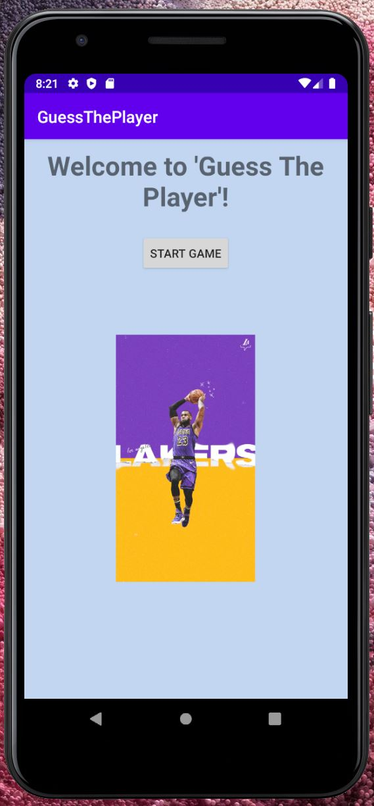

------------------------------------------
### Specifying Quiz Parameters
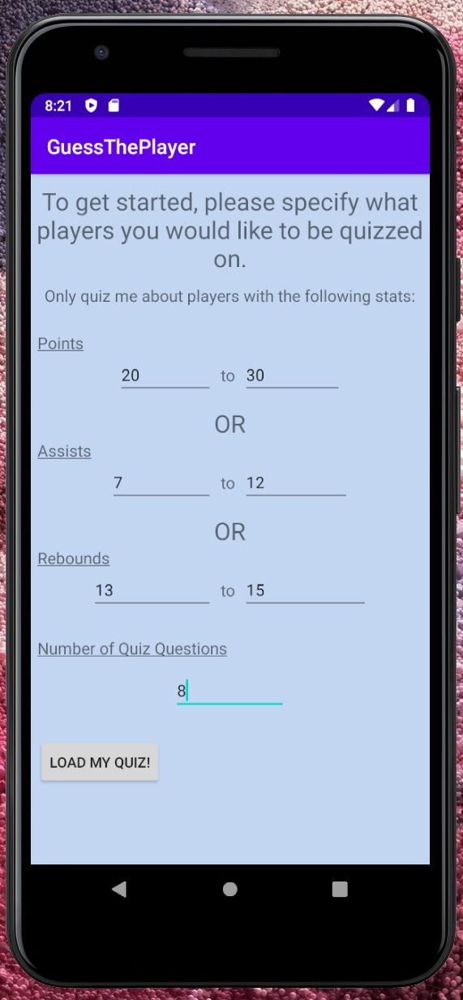

------------------------------------------
### Quiz Question 
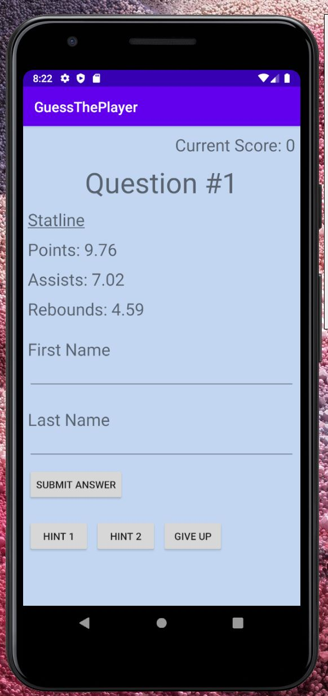

------------------------------------------
### Quiz Hints
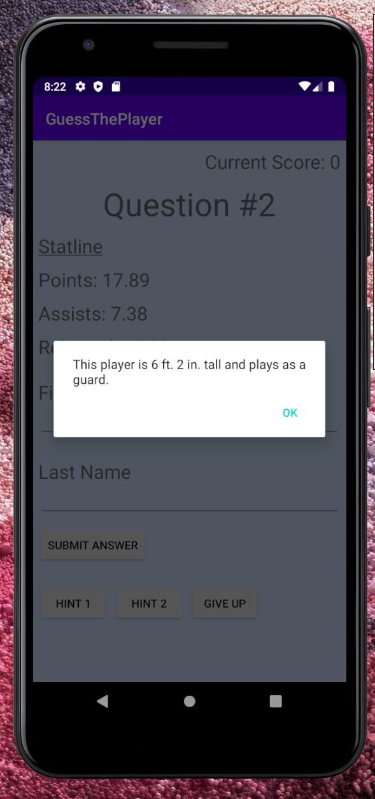 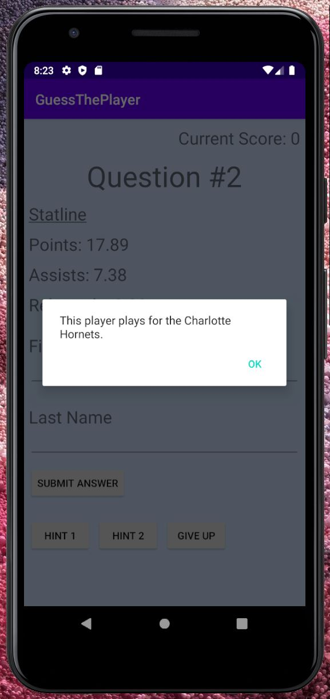

------------------------------------------
### Custom Question Images
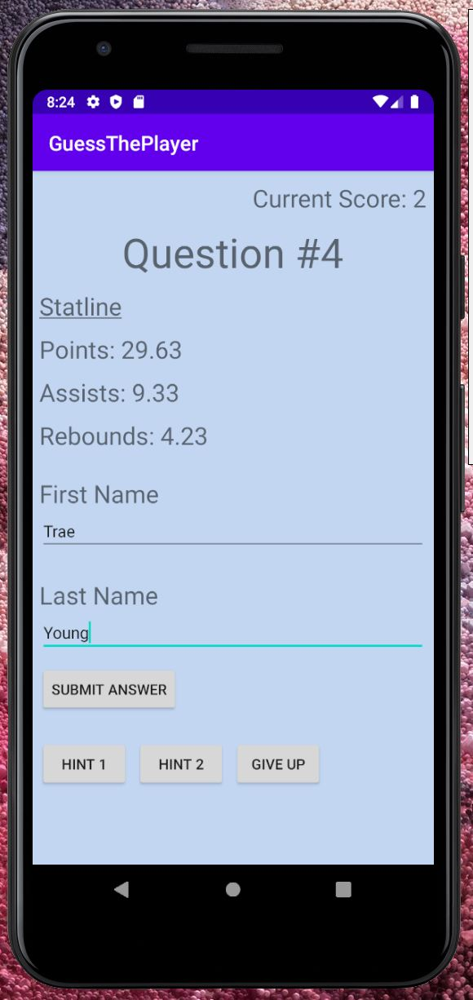 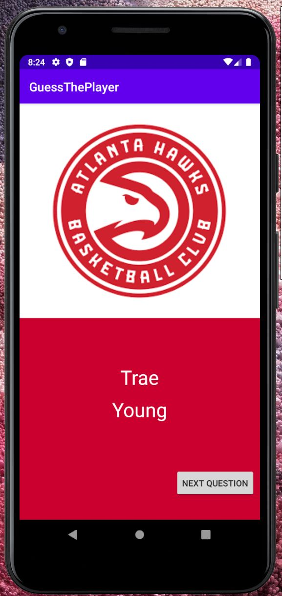

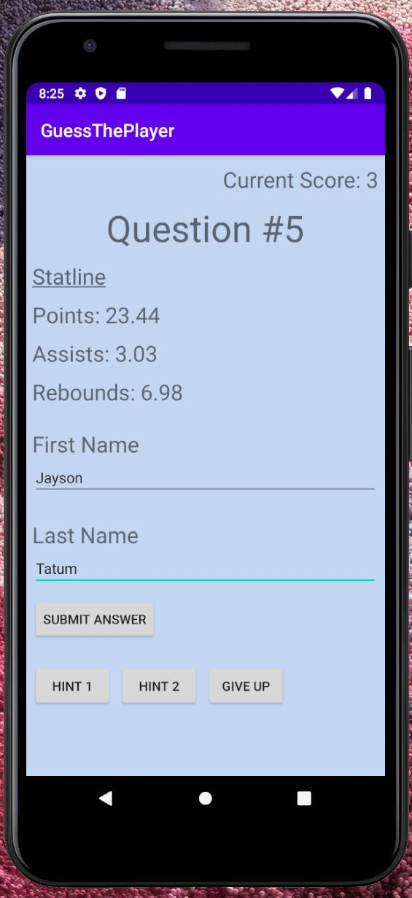 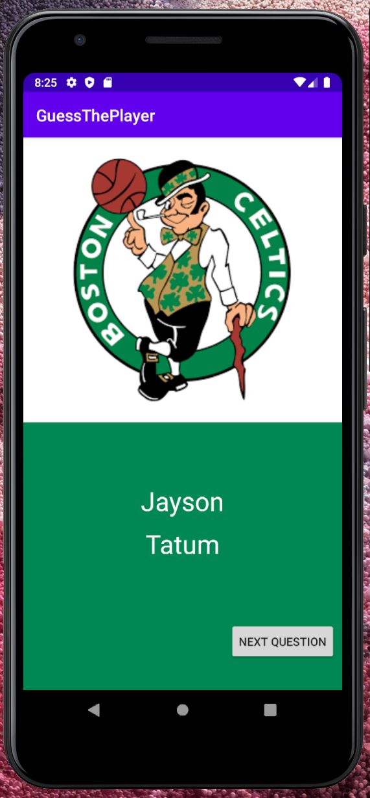

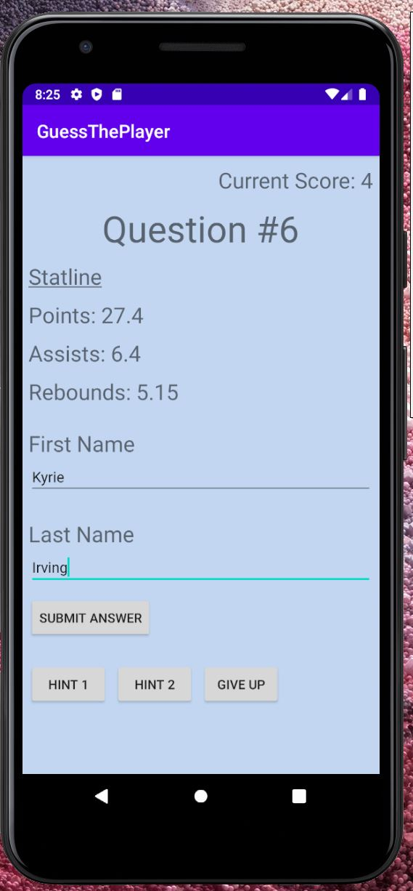 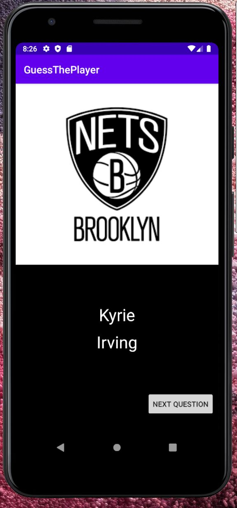

------------------------------------------
### Final Landing Page
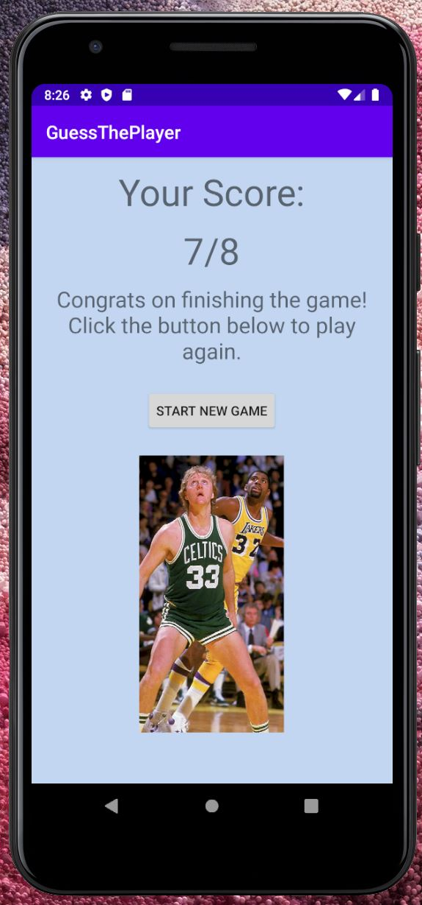

